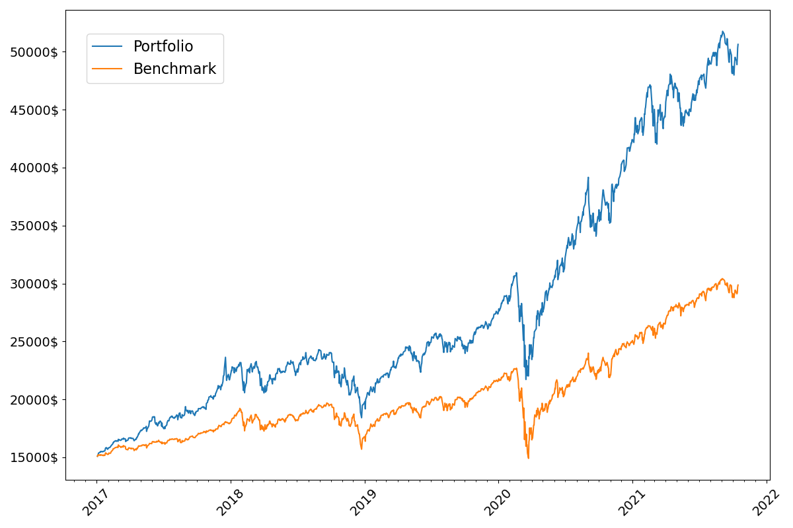

# TimePlot

## work-in-progress

Follow your stock portfolios and plot timeseries and historic data using Python.

This repository will be mainly used as template code for useful and clean time series visualizations.

## Benchmark against S&P500
Modify `portfolio.json` according to your stock portfolio and run `benchmark.py`.

Example output:

